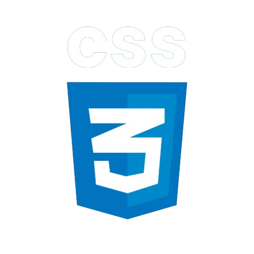

# CSS3
 Repositório de CSS3 do curso de Desenvolvimento web

## O que é CSS?
CSS, significa Cascading Style Sheets (Folhas de Estilo em Cascata, em português), é uma linguagem de estilo utilizada para descrever a apresentação de um documento escrito em HTML ou XML (incluindo várias linguagens XML como SVG, XHTML ou XUL). 

O principal objetivo do CSS é separar a estrutura do documento HTML da sua apresentação visual, permitindo um controle mais flexível e consistente sobre o layout, cores, fontes e outros aspectos visuais de uma página web.